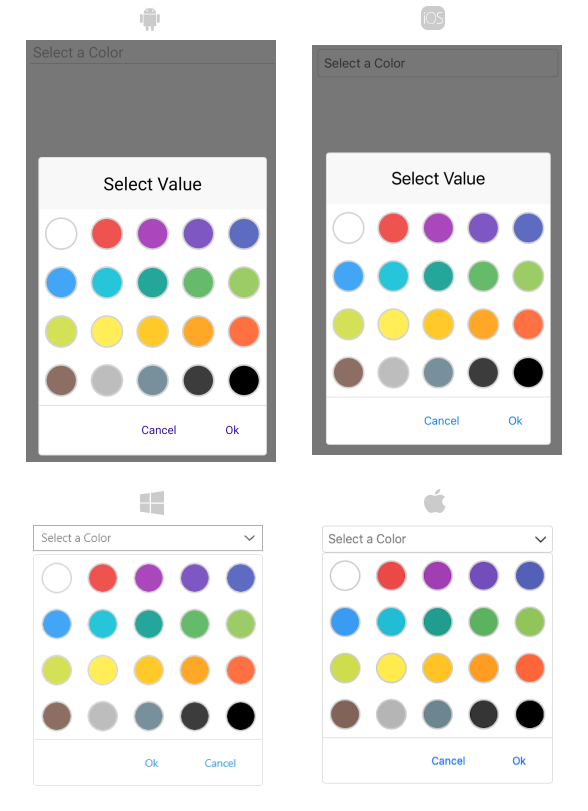

# Getting Started

This guide demonstrates how to add Telerik UI for .NET MAUI TemplatedPicker control to your application.

At the end, you will be able to achieve the following result:



## Prerequisites

Before adding the TemplatedPicker, first you need to [setup your .NET MAUI app](#setup-your-net-maui-app), and [download](#download-telerik-ui-for-net-maui) and [install Telerik UI for .NET MAUI](#install-telerik-ui-for-net-maui).

## Define RadTemplatedPicker control

TemplatedPicker exposes `SelectorTemplate`, which gives you the option to place any content inside the popup for the user to choose from, and `DisplayTemplate`, which allow you to present the selected value per your needs.

1. When the app is setup, you are ready to add a RadTemplatedPicker control to your page. The example demonstrates a custom picker control which gives the option to choose a color from a set of predefined colors.

 ```XAML
<telerikInput:RadTemplatedPicker Placeholder="Select a Color">
	<telerikInput:RadTemplatedPicker.BindingContext>
        <local:ColorViewModel />
    </telerikInput:RadTemplatedPicker.BindingContext>
    </telerikInput:RadTemplatedPicker.BindingContext>
	<telerikInput:RadTemplatedPicker.DisplayTemplate>
		<ControlTemplate>
			<Grid BackgroundColor="{TemplateBinding DisplayString}">
				<Grid.GestureRecognizers>
					<TapGestureRecognizer Command="{TemplateBinding ToggleCommand}" />
				</Grid.GestureRecognizers>
				<Label Margin="10, 0"
					   TextColor="Black"
					   VerticalOptions="Center"
					   Text="{TemplateBinding DisplayString}" />
			</Grid>
		</ControlTemplate>
	</telerikInput:RadTemplatedPicker.DisplayTemplate>
	<telerikInput:RadTemplatedPicker.SelectorTemplate>
		<ControlTemplate>
			<CollectionView HeightRequest="240"
							SelectionMode="Single"
							ItemsSource="{Binding Colors}"
							SelectedItem="{TemplateBinding SelectedValue, Mode=TwoWay}">
				<CollectionView.ItemTemplate>
					<DataTemplate>
						<Grid HeightRequest="60">
							<VisualStateManager.VisualStateGroups>
								<VisualStateGroup Name="CommonStates">
									<VisualState Name="Normal">
										<VisualState.Setters>
											<Setter Property="BackgroundColor" Value="White" />
										</VisualState.Setters>
									</VisualState>
									<VisualState Name="Selected">
										<VisualState.Setters>
											<Setter Property="BackgroundColor" Value="WhiteSmoke" />
										</VisualState.Setters>
									</VisualState>
								</VisualStateGroup>
							</VisualStateManager.VisualStateGroups>
							<telerik:RadBorder WidthRequest="40"
											   HeightRequest="40"
											   CornerRadius="20"
											   HorizontalOptions="Center"
											   VerticalOptions="Center"
											   BorderColor="LightGray"
											   BorderThickness="2"
											   BackgroundColor="{Binding}" />
						</Grid>
					</DataTemplate>
				</CollectionView.ItemTemplate>
				<CollectionView.ItemsLayout>
					<GridItemsLayout Orientation="Vertical" Span="5" />
				</CollectionView.ItemsLayout>
			</CollectionView>
		</ControlTemplate>
	</telerikInput:RadTemplatedPicker.SelectorTemplate>
</telerikInput:RadTemplatedPicker>
 ```
 
2. Add the referenced *ColorViewModel* which holds the collection with the predefined colors:

 ```C#
 public class ColorViewModel : NotifyPropertyChangedBase
 {
	public ColorViewModel()
	{
		this.Colors = new ObservableCollection<string>
		{
			"#FFFFFF",
			"#EE534F",
			"#AB47BC",
			"#7E57C2",
			"#5D6BC0",
			"#42A5F5",
			"#26C5DA",
			"#24A79A",
			"#66BB6A",
			"#9CCC65",
			"#D4E157",
			"#FFEE58",
			"#FFCA29",
			"#FFA726",
			"#FF7043",
			"#8D6E63",
			"#BDBDBD",
			"#78909C",
			"#3C3C3C",
			"#000000"
		};
	}

	public ObservableCollection<string> Colors { get; }
 }
 ```

3. Add the following namespace:

 ```XAML
xmlns:telerikInput="clr-namespace:Telerik.XamarinForms.Input;assembly=Telerik.Maui.Controls.Compatibility"
 ```

4. Register the Telerik controls through `Telerik.Maui.Controls.Compatibility.UseTelerik` extension method called inside the `Configure` method of the **Startup.cs** file of your project:

 ```C#
 using Telerik.Maui.Controls.Compatibility;

 public void Configure(IAppHostBuilder appBuilder)
 {
    appBuilder        
        .UseTelerik()
        .UseMauiApp<App>();    
 }              
 ```
 
## See Also

- [Visual Structure]()
- [Key Features]()
- [Templates]()
- [Styling]()