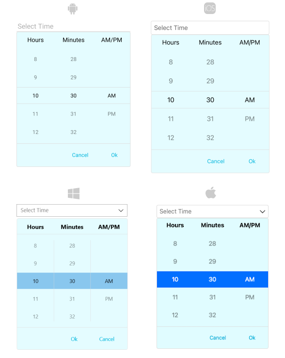

# DropDown Styling

By using the `DropDownSettings` property (of type `Telerik.XamarinForms.Input.PickerDropDownSettings`) of the TimePicker, you can modify the appearance of the dropdown. The `PickerDropDownSettings` class exposes the following `Style` properties:

* `DropDownViewStyle`(of type `Style` with target type `telerik:PickerDropDownContentView`)&mdash;Defines the dropdown view style.
* `FooterStyle`(of type `Style` with target type `telerik:PickerPopupFooterView`)&mdash;Defines the dropdown footer style.
* `AcceptButtonStyle`(of type `Style` with target type `Button`)&mdash;Defines the **Accept** button style.
* `CancelButtonStyle`(of type `Style` with target type `Button`)&mdash;Defines the **Cancel** button style.

The `DropDownSettings` also provides the following properties for dropdown customization:

* `Placement`(of type `PlacementMode`)&mdash;Specifies the position of the dropdown, can be set to Bottom, Right, Left, Top, Center or Relative.
* `HorizontalOffset` \ `VerticalOffset`&mdash;Specifies the horizontal\vertical distance between the dropdown and the TimePicker.
* `IsFooterVisible`(`bool`)&mdash;Specifies whether the DropDown footer is currently visible. By default, the value is `True`.
* `AcceptButtonText`(`string`)&mdash;Defines the text visualized for the **Accept** button. By default, the text is `OK`.
* `CancelButtonText`(`string`)&mdash;Defines the text visualized for the **Cancel** button. By default, the text is `Cancel`.

> __DropDownSettings__ provides styling options for the dropdown, its footer and position, and other. If you need to customize the look&feel of the spinner controls that show the available date values, please refer to `SpinnerStyle`, `SpinnerHeaderStyle` and `SelectionHighlightStyle` properties of the TimePicker. For more detailed information on them go to [TimePicker Styling]() topic.

## Example

The following example shows how the styling properties are applied.

**Define the `RadTimePicker`**

<snippet id='timepicker-dropdown-style' />

**Define the DropDownViewStyle**

<snippet id='dropDownViewStyle' />

**Define the FooterStyle**

<snippet id='timepicker-style-footer-style' />

**Define the AcceptButtonStyle**

<snippet id='timepicker-style-accept-button-style' />

**Define the CancelButtonStyle**

<snippet id='timepicker-style-cancel-button-style' />

## Namespaces

In addition, add the following namespace:

```XAML
xmlns:telerik="http://schemas.telerik.com/2022/xaml/maui"
```

The following image shows how the TimePicker control looks when the styles described above are applied.



## See Also

- [TimePicker Styling]()
- [Custom Templates]()
- [Commands]()
- [Visual Structure]()
