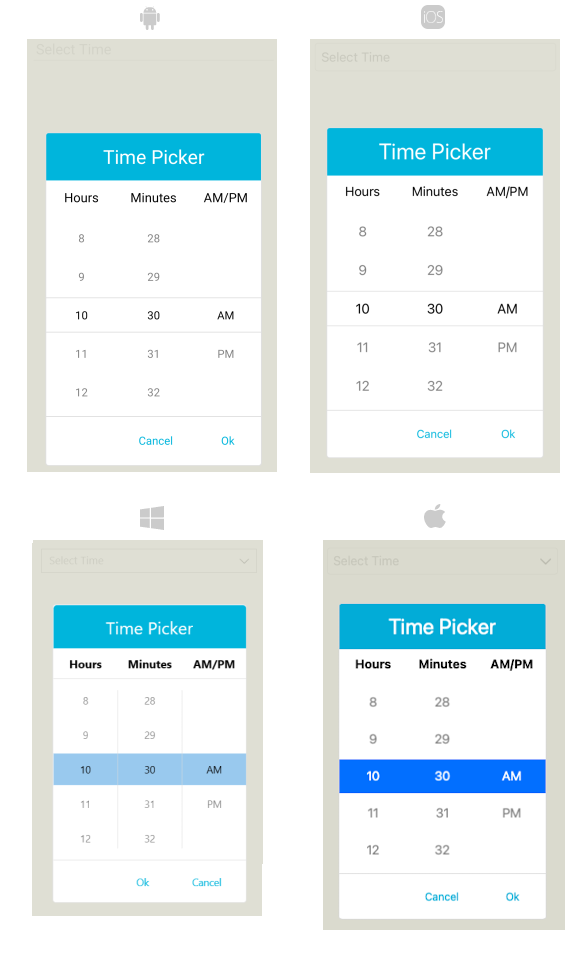

# .NET MAUI TimePicker Popup Styling

By using the `PopupSettings` property (of type `Telerik.XamarinForms.Input.PickerPopupSettings`) of the TimePicker, you can modify the appearance of the dialog (popup).

The `PickerPopupSettings` class exposes the following `Style` properties:

* `PopupViewStyle`(of type `Style` with target type `telerik:PickerPopupContentView`)&mdash;Defines the popup view style.
* `HeaderStyle`(of type `Style` with target type `telerik:PickerPopupHeaderView`)&mdash;Defines the popup header style.
* `HeaderLabelStyle`(of type `Style` with target type `Label`)&mdash;Defines the popup header label style.
* `FooterStyle`(of type `Style` with target type `telerik:PickerPopupFooterView`)&mdash;Defines the popup footer style.
* `AcceptButtonStyle`(of type `Style` with target type `Button`)&mdash;Defines the **Accept** button style.
* `CancelButtonStyle`(of type `Style` with target type `Button`)&mdash;Defines the **Cancel** button style.

The `PickerPopupSettings` also provides the following properties for popup customization:

* `PopupOutsideBackgroundColor`&mdash;Defines the color outside of the popup.
* `IsPopupModal`(`bool`)&mdash;Defines a boolean value indicating if the popup will be closed when users click outside of the popup.
	* When `IsPopupModal="True"`, the UI behind the popup gets inactive and cannot be used until the popup is closed.
	* When `IsPopupModal="False"`, the popup can be closed when clicking outside the popup. By default, the value of the `IsPopupModal` is `False`.

* `HeaderLabelText`(`string`)&mdash;Specifies the text visualized in the popup header.
* `IsHeaderVisible`(`bool`)&mdash;Specifies whether the Popup header is currently visible. By default, the value is `True`.
* `IsFooterVisible`(`bool`)&mdash;Specifies whether the Popup footer is currently visible. By default, the value is `True`.
* `AcceptButtonText`(`string`)&mdash;Defines the text visualized for the accept button. By default, the text is `OK`.
* `CancelButtonText`(`string`)&mdash;Defines the text visualized for the cancel button. By default, the text is `Cancel`.

> __PopupSettings__ provides styling options for the popup, its header and footer, outside background color and other. If you need to customize the look&feel of the spinner controls that show the available time values, please refer to `SpinnerStyle`, `SpinnerHeaderStyle` and `SelectionHighlightStyle` properties of the TimePicker. For more detailed information on them go to [TimePicker Styling]() topic.

## Example

The following example shows how the styling properties are applied.

**Define the `RadTimePicker`**

<snippet id='timepicker-popup-style' />

**Define the PopupViewStyle**

<snippet id='timepicker-style-popupview-style' />

**Define the HeaderStyle**

<snippet id='timepicker-style-header-style' />

**Define the HeaderLabelStyle**

<snippet id='timepicker-style-header-label-style' />

**Define the FooterStyle**

<snippet id='timepicker-style-footer-style' />

**Define the AcceptButtonStyle**

<snippet id='timepicker-style-accept-button-style' />

**Define the CancelButtonStyle**

<snippet id='timepicker-style-cancel-button-style' />

## Namespaces

In addition, add the following namespace:

```XAML
xmlns:telerik="http://schemas.telerik.com/2022/xaml/maui"
```

The following image shows how the TimePicker control looks when the styles described above are applied.



## See Also

- [TimePicker Styling]()
- [Custom Templates]()
- [Commands]()
- [Visual Structure]()
