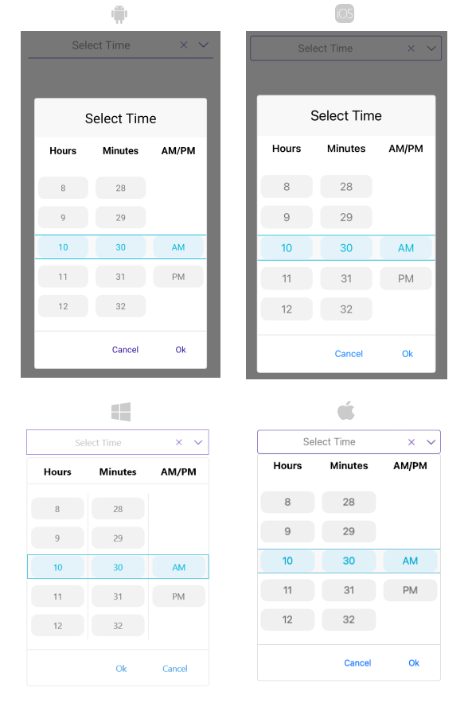

# .NET MAUI TimePicker Styling

The TimePicker control for .NET MAUI provides styling options for customizing its appearance. You can style the TimePicker itself, as well as its popup or dropdown depending on the [PickerMode]() setting.

The control supports the following styling properties:

* `BackgroundColor`&mdash;Defines the background color of the picker.
* `BorderColor`&mdash;Defines the border color of the picker.
* `BorderThickness`&mdash;Specifies the border thickness of the picker. The default value is `new Thickness(0,0,0,1)`.
* `CornerRadius`&mdash;Specifies the corner radius of the picker.
* `ClearButtonStyle`(of type `Style` with target type `RadButton`)&mdash;Defines the style applied to the [Clear button](#clear-button).
* `ToggleButtonStyle`(of type `Style` with target type `RadButton`)&mdash;Specifies the style of the [Toggle button](##toggle-button).
* `PlaceholderLabelStyle`(of type `Style` with target type `Label`)&mdash;Defines the style applied to the placeholder label.
* `DisplayLabelStyle`(of type `Style` with target type `Label`)&mdash;Defines the style applied to the label which is visualized when time is selected.

The following Style properties are related to the spinner controls inside the popup/dropdown:

* `SpinnerStyle`(of type `Style` with target type `telerikDataControls:RadSpinner`)&mdash;Defines the style applied to the spinner item and to the selected item.
* `SpinnerHeaderStyle`(of type `Style` with target type `Label`)&mdash;Specifies the style applied to the spinner header labels.
* `SelectionHighlightStyle`(of type `Style` with target type `telerikPrimitives:RadBorder`)&mdash;Specifies the style applied to the selection inside the popup.


## Namespaces

When defining some of these styles, you need to include additional namespaces, so that the target types are properly resolved.

When you use `SelectionHighlightStyle` and `SpinnerStyle`, you need to add the following namespace:

```XAML
xmlns:telerik="http://schemas.telerik.com/2022/xaml/maui"
```

## Example

The following example shows how the styling properties can be applied.

**Define the `RadTimePicker`**

<snippet id='timepicker-popup-style' />

**Define the SpinnerStyle**

<snippet id='timepicker-style-spinner-style' />

**Define the SelectionHighlightStyle**

<snippet id='timepicker-style-selection-highlight-style' />

**Define the PlaceholderLabelStyle**

<snippet id='timepicker-style-placeholder-label-style' />

**Define the DisplayLabelStyle**

<snippet id='timepicker-style-display-label-style' />

**Define the ClearButtonStyle**

<snippet id='timepicker-style-clear-button-style' />

**Define the ToggleButtonStyle**

<snippet id='timepicker-style-toggle-button-style' />


## Namespaces

In addition, add the following namespaces:

```XAML
xmlns:telerik="http://schemas.telerik.com/2022/xaml/maui"
```

The following image shows how the TimePicker control looks when the styles described above are applied.



## See Also

- [Picker Mode]()
- [Custom Templates]()
- [Commands]()
- [Visual Structure]()
