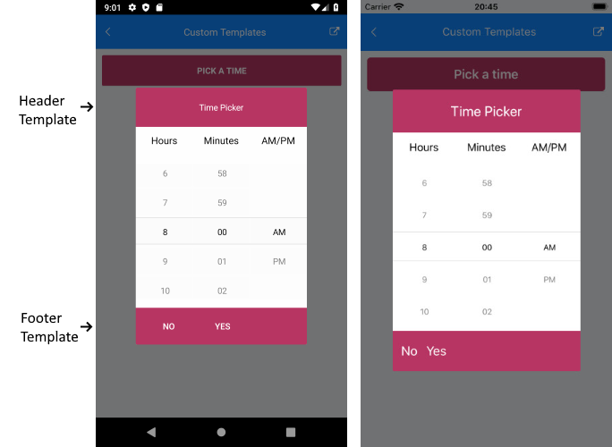

# Templates

In case the default templates of the TimePicker control do not suit your needs, you can easily define a custom template.

The available templates for customization are:

* `PlaceholderTemplate`(`ControlTemplate`)&mdash;Defines the template visualized for the placeholder.  
* `DisplayTemplate`(`ControlTemplate`)&mdash;Defines the template visualized when the picked time is displayed.
* `HeaderTemplate`(`ControlTemplate`)&mdash;Defines what will be displayed inside the dialog (popup) header.
* `FooterTemplate`(`ControlTemplate`)&mdash;Defines what will be displayed inside the dialog (popup) footer.

The example below shows a sample TimePicker definition with the listed above template properties applied:

1. Define the TimePicker.

 ```XAML
<telerikInput:RadTimePicker SpinnerFormat="H:mm"
                            PlaceholderTemplate="{StaticResource placeholderTemplate}"
                            DisplayTemplate="{StaticResource displayTemplate}">
    <telerikInput:RadTimePicker.SelectorSettings>
        <telerikInput:PickerPopupSelectorSettings HeaderTemplate="{StaticResource headerTemplate}"
                                                  FooterTemplate="{StaticResource footerTemplate}"/>
    </telerikInput:RadTimePicker.SelectorSettings>
</telerikInput:RadTimePicker>
 ```

1. Add the following namespace:

 ```XAML
 xmlns:telerikInput="clr-namespace:Telerik.XamarinForms.Input;assembly=Telerik.Maui.Controls.Compatibility"
 ```

For the example, the template definitions are added to the page resources as follows.

## PlaceholderTemplate

```XAML
<ControlTemplate x:Key="placeholderTemplate">
    <Button Text="Pick a time"
            FontAttributes="Bold"
            TextColor="White"
            BackgroundColor="#B73562"
            HeightRequest="50" Command="{TemplateBinding ToggleCommand}" />
</ControlTemplate>
```


## DisplayTemplate

```XAML
<ControlTemplate x:Key="displayTemplate">
    <Button Text="{TemplateBinding DisplayString}"
            TextColor="White"
            BackgroundColor="#7BAEFF"
            HeightRequest="50"
            Command="{TemplateBinding ToggleCommand}" />
</ControlTemplate>
```


## HeaderTemplate

```XAML
<ControlTemplate x:Key="headerTemplate">
    <Label Text="Time Picker"
           TextColor="White"
           VerticalTextAlignment="Center"
           HorizontalTextAlignment="Center"
           BackgroundColor="#B73562"/>
</ControlTemplate>
```

## FooterTemplate

```XAML
<ControlTemplate x:Key="footerTemplate">
    <StackLayout Orientation="Horizontal" Spacing="0" HorizontalOptions="FillAndExpand" BackgroundColor="#B73562">
        <Button Text="No"
                TextColor="White"
                BackgroundColor="Transparent"
                Command="{TemplateBinding CancelCommand}" />
        <Button Text="Yes"
                TextColor="White"
                BackgroundColor="Transparent"
                Command="{TemplateBinding AcceptCommand}" />
    </StackLayout>
</ControlTemplate>
```




## See Also

- [Suppoted Standard Time Format Strings]()
- [Styling]()
