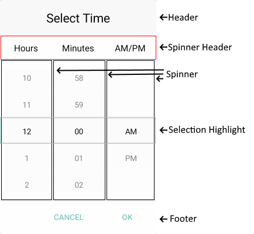

# Visual Structure

Here are described all visual elements used in the TimePicker for .NET MAUI.

## Time Picker Structure before and after a time value is selected

## Picker Popup Visual Structure

## Legend ##

- **Placeholder** - the text visualized before picking a time value. Placeholder can be customized through the [PlaceholderTemplate](#placeholdertemplate) property.
- **DisplayStringFormat** - the text visualized after a time value is picked.
- **Header** - the text displayed in the popup header. It can be set to a direct text through the [HeaderLabelText](#popup-styling) property or fully customize the popup header using the [HeaderTemplate](#headertemplate) property.
- **SpinnerHeader** - the text visualized for spinner header depending on the values to be picked. For example if the `SpinnerFormatString` is *g* and `AreSpinnerHeadersVisible="True"` The text visualized for spinner header will be **Hour** **Minutes** **AM/PM**.
- **Spinner** - displays items in a list.
- **SelectionHighlight** - highlight the currently selected time when the popup is open.
- **Footer** - the footer of the popup. By default is contains OK and Cancel Buttons. It can be customized through the [FooterTemplate](#footertemplate) property.

## See Also

- [Getting Started]()
- [Time Format Strings]()