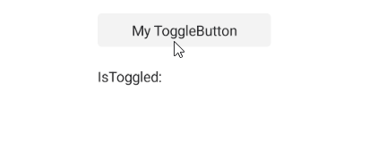
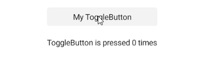

# .NET MAUI ToggleButton Events

The .NET MAUI ToggleButton emits a set of events that allow you to configure the component's behavior in response to specific user actions.

The .NET MAUI ToggleButton exposes the following events:

* `IsToggledChanged`&mdash;Occurs when the `RadToggleButton.IsToggled` property is changed. The `IsToggledChanged` event handler receives two parameters:
    * The `sender` which is of type `Telerik.Maui.Controls.RadToggleButton`.
    * `ValueChangedEventArgs` which provides the following properties:
        * `NewValue`(`TValue`)&mdash;Gets the new value from the `IsToggled` property.
        * `PreviousValue`(`TValue`)&mdash;Gets the previous value of the `IsToggled` property.

* `Clicked`&mdash;Raised when the `RadToggleButton` is clicked. The `Clicked` event handler receives two parameters:
	* The `sender` argument which is of type `RadToggleButton`.
	* An `EventArgs` object which provides information about the `Clicked` event.

* `Pressed`&mdash;Raised when `RadToggleButton` is pressed (a finger presses on the buton, or a mouse button is pressed with a pointer positioned over the button). The `Pressed` event handler receives two parameters:
	* The `sender` argument which is of type `RadToggleButton`.
	* An `EventHandler` object which provides information on the `Pressed` event.
	
* `Released`&mdash;Raised when the `RadToggleButton` is released (the finger or mouse button is released). The `Released` event handler receives two parameters:
	* The `sender` argument which is of type `RadToggleButton`.
	* An `EventHandler` object which provides information on the `Released` event.

## Using the IsToggledChanged Event

The following example demonstrates how to use the `IsToggledChanged` event:

**1.** Define the button in XAML:

<snippet id='togglebutton-events-togglechanged' />

**2.** Add the `telerik` namespace:

```XAML
xmlns:telerik="http://schemas.telerik.com/2022/xaml/maui"
```

**3.** Add the `IsToggledChanged` event:

<snippet id='togglebutton-events-togglechanged-handler' />

This is the result on Android:



> For a runnable example demonstrating the ToggleButton `IsToggledChanged` event, see the [SDKBrowser Demo Application]() and go to the **ToggleButton > Events** category.

## Using the Clicked Event

The following example demonstrates how to use the `Clicked` event:

**1.** Define the button in XAML:

<snippet id='togglebutton-event-clicked' />

**2.** Add the `telerik` namespace:

```XAML
xmlns:telerik="http://schemas.telerik.com/2022/xaml/maui"
```

**3.** Add the `Clicked` event:

<snippet id='togglebutton-clicked-event' />

This is the result on Android:


> For a runnable example demonstrating the ToggleButton `Clicked` event, see the [SDKBrowser Demo Application]() and go to the **ToggleButton > Events** category.

## Using the Pressed Event

The following example demonstrates how to use the `Pressed` event:

**1.** Define the button in XAML:

<snippet id='togglebutton-event-pressed' />

**2.** Add the `telerik` namespace:

```XAML
xmlns:telerik="http://schemas.telerik.com/2022/xaml/maui"
```

**3.** Add the `Pressed` event:

<snippet id='togglebutton-pressed-event' />

This is the result on Android:


> For a runnable example demonstrating the ToggleButton `Pressed` event, see the [SDKBrowser Demo Application]() and go to the **ToggleButton > Events** category.

## Using the Released Event

The following example demonstrates how to use the `Released` event:

**1.** Define the button in XAML:

<snippet id='togglebutton-event-released' />

**2.** Add the `telerik` namespace:

```XAML
xmlns:telerik="http://schemas.telerik.com/2022/xaml/maui"
```

**3.** Add the `Released` event:

<snippet id='togglebutton-released-event' />

This is the result on Android:



> For a runnable example demonstrating the ToggleButton `Released` event, see the [SDKBrowser Demo Application]() and go to the **ToggleButton > Events** category.

## See Also

- [Configure the ToggleButton]()
- [Toggle State]()
- [Set Visual States]()
- [Execute Command]()
- [Style the ToggleButton]()