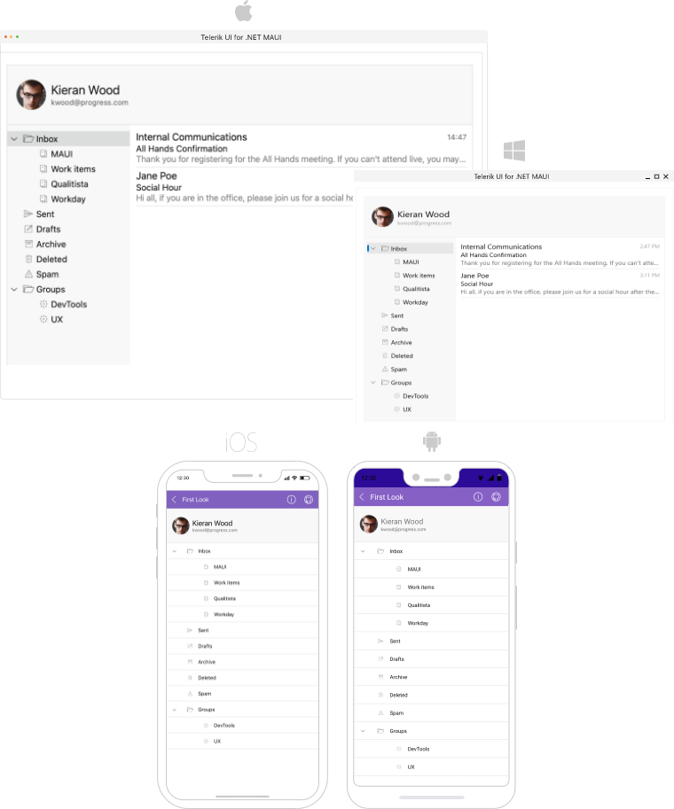

# .NET MAUI TreeView Overview

The Telerik UI for .NET MAUI TreeView represents hierarchical data in a tree like structure. It supports manipulation of its tree nodes, such as expand and collapse, provides selection, checkboxes, flexible styling API, commands support, and more.

To populate the TreeView, you can use any data source that is hierarchical in nature. 

## Key Features

* Hierarchical Navigation&mdash;TreeView improves the navigation and performance of your application where navigation over hierarchical structure is required.
* [Expand/Collapse items]()&mdash;The control introduces methods which can be used to programmatically expand/collapse item or all items. 
* [Commands]()&mdash;TreeView provides commands for expanding, collapsing, checking, and unchecking the items. 
* [Checkbox Support]()&mdash;Telerik `RadTreeView` provides checkbox buttons displayed next to each item. The `RadTreeView` allows the user to check/uncheck the node or all nodes and to perform various tasks with the collection of checked nodes. The three states checkbox mode of the `RadTreeView` control allows the  `RadTreeViewItems`' checkboxes to have an additional, third state&mdash;Indeterminate.
* [Data Binding]()&mdash;Simply setting the collection of custom business objects as an `ItemsSource` in combination with a `TreeViewDescriptor` class to visualize the hierarchically-structured source.
* Image elements&mdash;TreeView control allows you to display images in the TreeView item.
* [Custom Item Template]()&mdash;Apply template to the TreeView items on `TreeViewDescriptor` level or on TreeView level.
* UI Virtualization&mdash;The user interface uses virtualization to display the required elements, meaning that they are created only when needed and only for the currently visible cells.
* [Different selection]()&mdash;The .NET MAUI TreeView supports both single and multiple selection. In addition, you can disable the selection. 
* [Vertical scrolling]()&mdash;Scroll through the items vertically and use the option to scroll to a concrete item. 
* [Horizontal scrolling]()&mdash;Scroll through the items horizontally by setting the `ScrollOrientation` to `Both`.
* [Style properties]()&mdash;The available styling properties allow you to customize the items. To take advantage of the conditional styling feature provided by the TreeView, you can use the [style selector]().
* Empty template&mdash;Set an empty template if the default one does not fit in the scenario you have.

## Next Steps

- [Getting Started with the .NET MAUI TreeView]()

## See Also

- [.NET MAUI TreeView Product Page](https://www.telerik.com/maui-ui/treeview)
- [.NET MAUI TreeView Forum Page](https://www.telerik.com/forums/maui?tagId=2056)
- [Telerik .NET MAUI Blogs](https://www.telerik.com/blogs/mobile-net-maui)
- [Telerik .NET MAUI Roadmap](https://www.telerik.com/support/whats-new/maui-ui/roadmap)
