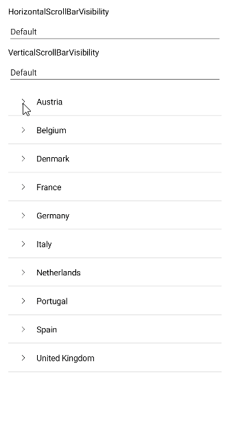
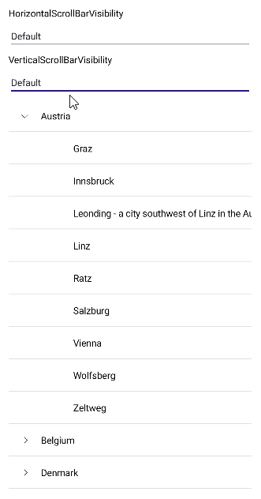
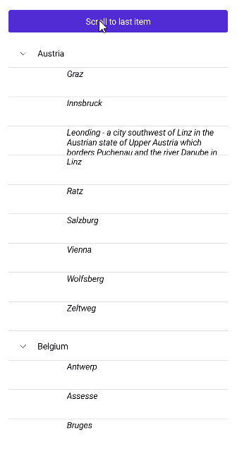

# Scrolling

You can enable users to scroll in the TreeView in both directions&mdash;horizontally and vertically&mdash;or choose only one direction. 

## Scroll Orientation

To configure the scroll direction for the TreeView items, use the `ScrollOrientation` (enum of type `Telerik.Maui.Controls.TreeView.TreeViewScrollOrientation`) property. It accepts the following values:

* (Default value) `Vertical`&mdash;Allows the user to scroll the TreeView only in a vertical direction.
* `Both`&mdash;Allows the user to scroll the TreeView both in a vertical and horizontal direction.

## Vertical Scrolling

Configure the vertical scrollbar by using the following properties:

* `VerticalScrollBarVisibility` (enum of type `Microsoft.Maui.ScrollBarVisibility`)&mdash;Specifies the visibility of the vertical scrollbar. The available options are: 
	* `Default`&mdash;Applies the default visibility for the platform based on the content and orientation.
	* `Always`&mdash;The scrollbar is visible, regardless of the content or orientation.
	* `Never`&mdash;The scrollbar is not visible.

* `VerticalScrollBarLayoutMode` (enum of type `Telerik.Maui.Controls.ItemsView.ScrollBarLayoutMode`)&mdash;Specifies the layout mode of the vertical scrollbar. The available options are: 
	* `Overlay`&mdash;The scrollbars overlay the scrollable content when visible.
	* `Resize`&mdash;The scrollbars resize the scrollable content when visible.

## Horizontal Scrolling

Configure the horizontal scrollbar by using the following properties:

* `HorizontalScrollBarVisibility` (enum of type `Microsoft.Maui.ScrollBarVisibility`)&mdash;Specifies the visibility of the horizontal scrollbar.
The available options are: 
	* `Default`&mdash;Applies the default visibility for the platform based on the content and orientation.
	* `Always`&mdash;The scrollbar is visible, regardless of the content or orientation.
	* `Never`&mdash;The scrollbar is not visible.

* `HorizontalScrollBarLayoutMode` (enum of type `Telerik.Maui.Controls.ItemsView.ScrollBarLayoutMode`)&mdash;Specifies the layout mode of the horizontal scrollbar. 
The available options are: 
	* `Overlay`&mdash;The scrollbars overlay the scrollable content when visible.
	* `Resize`&mdash;The scrollbars resize the scrollable content when visible.

## Example: Configuring the Scrollbar and Scroll Orientation

The following example demonstrates how to configure horizontal and vertical scrolling when working with the .NET MAUI TreeView control.

**1.** Define the `RadTreeView` control:

<snippet id='treeview-scrolling'/>

**2.** Add the location data model:

<snippet id='treeview-location-model'/>

**3.** Add the country data model:

<snippet id='treeview-country-model'/>

**4.** Add the city data model:

<snippet id='treeview-city-model'/>

**5.** Add the ViewModel:

<snippet id='treeview-location-viewmodel'/>

## Methods 

The TreeView provides the `ScrollTo` method that allows you to configure the control to display a specific item:

* `ScrollTo`(`object dataItem`)&mdash;Scrolls the visible area of the control so that the specified item is visible. The parameter is `dataItem`&mdash;Specifies the item to scroll to.

The example below demonstrates how to use the `ScrollTo` method.

**1.** Define the `RadTreeview` control: 

<snippet id='treeview-programmatic-scrolling-xaml'/>

**2.** Configure the `ScrollTo` executon on button click:

<snippet id='treeview-programmatic-scrolling'/>

**3.** Add the location data model:

<snippet id='treeview-location-model'/>

**4.** Add the country data model:

<snippet id='treeview-country-model'/>

**5.** Add the city data model:

<snippet id='treeview-city-model'/>

**6.** Add the ViewModel:

<snippet id='treeview-location-viewmodel'/>

## Commands

In addition to the `ScrollTo` method, the TreeView exposes the `ScrollToCommand`that allows you to configure the control to display a specific item:

* `ScrollToCommand`(`ICommand`)&mdash;Gets a command that scrolls to an item in the control, which is specified as a parameter.

> For a runnable example demonstrating the TreeView scrolling feature, see the [SDKBrowser Demo Application]() and go to **TreeView > Scrolling**.

## See Also

* [Expand and Collapse TreeView Items]()
* [CheckBoxes in TreeView]()
* [Styling the TreeView Item]()
* [Multiple and Single Selection]()
* [Events]()
* [Available Commands in .NET MAUI TreeView]()
