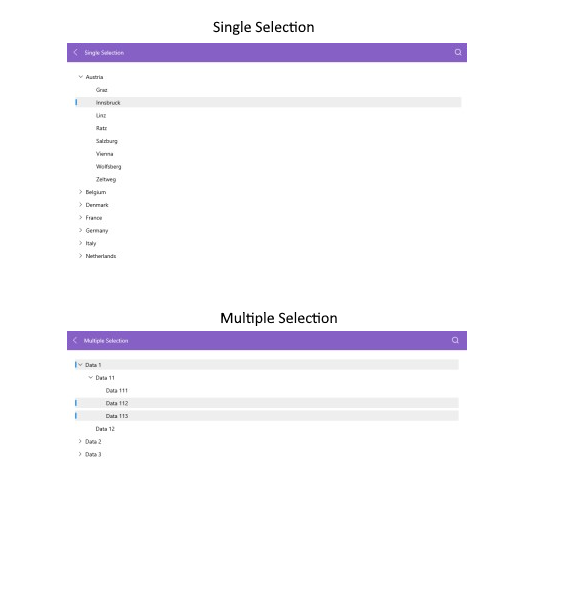

# Selection

The TreeView for .NET MAUI exposes the Selection feature, which allows the user to select single or multiple items in the TreeView. This feature provides both visual and programmatic feedback for the user's actions. If needed, you can disable the Selection.

## Selection Mode

The TreeView provides three selection modes, which allow you to manipulate the selection type. This is controlled by the `SelectionMode` (`Microsoft.Maui.Controls.SelectionMode`) property which has the following entries:

- `None`&mdash;The users cannot select an item.
- `Single` (default)&mdash;The users can select only one item.
- `Multiple`&mdash;The users can select more than one item.



## Setting the Selected Item

The TreeView provides the `SelectedItem` (`object`) property, which specifies the last selected item of the TreeView.

The following example demonstrates how to use the `SelectedItem` property:

**1.** Define the `RadTreeView` control: 

<snippet id='treeview-selected-item'/>

**2.** Add the `telerik` namespace:

```XAML
xmlns:telerik="http://schemas.telerik.com/2022/xaml/maui"
```

**3.** Add the `City` and `Country` model: 

<snippet id='treeview-country-model'/>
<snippet id='treeview-city-model'/>

**4.** Add the ViewModel: 

<snippet id='treeview-location-viewmodel'/>

> For a runnable example demonstrating the TreeView `SelectedItem`, see the [SDKBrowser Demo Application]() and go to **TreeView > Selection**.

## Selected Items Collection

The TreeView provides the `SelectedItems` collection of type `IList`. The collection contains the items that are currently selected in the control.

The following example demonstrates how to use the `SelectedItems` collection:

**1.** Define the `RadTreeView` control: 

<snippet id='treeview-multiple-selection'/>

**2.** Add the `telerik` namespace:

```XAML
xmlns:telerik="http://schemas.telerik.com/2022/xaml/maui"
```

**3.** Add the data model: 

<snippet id='treeview-events-data'/>

**4.** Add the ViewModel: 

<snippet id='treeview-events-viewmodel'/>

> For a runnable example demonstrating the TreeView `SelectedItems`, see the [SDKBrowser Demo Application]() and go to **TreeView > Selection**.

## Selection Events

The TreeView provides the `SelectionChanged` event, which is raised when the current selection changes. The `SelectionChanged` event handler receives two parameters:

* The sender argument, which is of type `object`, but can be cast to the `RadTreeView` type.
* A `EventArgs` object, which provides information on the `SelectionChanged` event.

> For a runnable example demonstrating the TreeView events, see the [SDKBrowser Demo Application]() and go to **TreeView > Events**.

This is the result on Android:


## See Also

* [Expand and Collapse TreeView Items]()
* [CheckBoxes in TreeView]()
* [Styling the TreeView Item]()
* [Scrolling options]()
* [Events]()
* [Available Commands in .NET MAUI TreeView]()
