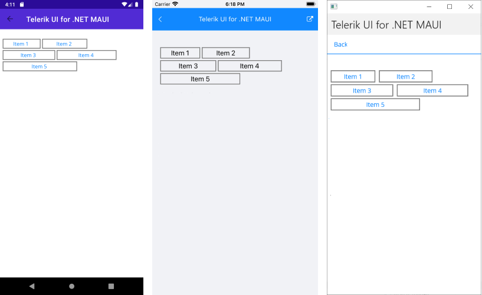

# Getting Started

## Define RadWrapLayout control

```XAML
<telerik:RadWrapLayout Orientation="Horizontal">
	<telerik:RadBorder BorderColor="Gray" BorderThickness="2" Margin="2" WidthRequest="100">
		<Label Text="Item 1" HorizontalOptions="Center" Margin="2"/>
	</telerik:RadBorder>
	<telerik:RadBorder BorderColor="Gray" BorderThickness="2" Margin="2" WidthRequest="120">
		<Label Text="Item 2" HorizontalOptions="Center" Margin="2"/>
	</telerik:RadBorder>
	<telerik:RadBorder BorderColor="Gray" BorderThickness="2" Margin="2" WidthRequest="140">
		<Label Text="Item 3" HorizontalOptions="Center" Margin="2"/>
	</telerik:RadBorder>
	<telerik:RadBorder BorderColor="Gray" BorderThickness="2" Margin="2" WidthRequest="160">
		<Label Text="Item 4" HorizontalOptions="Center" Margin="2"/>
	</telerik:RadBorder>
	<telerik:RadBorder BorderColor="Gray" BorderThickness="2" Margin="2" WidthRequest="200">
		<Label Text="Item 5" HorizontalOptions="Center" Margin="2"/>
	</telerik:RadBorder>
</telerik:RadWrapLayout>
```

In addition to this you need to add the following namespace:

```XAML
xmlns:telerik="clr-namespace:Telerik.Maui.Controls;assembly=Telerik.Maui.Controls"
```

Register the Telerik controls through `Telerik.Maui.Controls.Compatibility.UseTelerik` extension method called inside the `Configure` method of the **Startup.cs** file of your project:

```C#
using Telerik.Maui.Controls.Compatibility;

public void Configure(IAppHostBuilder appBuilder)
{
	appBuilder		
		.UseTelerik()
		.UseMauiApp<App>();
		
}              
```

This is the result:



## See Also

- [Wrap Functionality]()