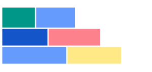

# Overview #

**Telerik RadWrapLayout for .NET MAUI** is a layout that provides a mechanism for child elements to be arranged in rows or columns depending on orientation property until space is filled and then wraps them on а new row or column.

## Key features

* **Wrap Orientation**: Through the `Orientation` property you can control whether the child items will be wrapped in rows - Horizontal orientation or in columns - Vertical orientation. Go to [Wrap Orientation]() topic for more details.
* **Items Size**: WrapLayout exposes `ItemWidth` and `ItemHeight` properties which lets you specify the size of the child elements. For more information on this check [Item Size](##item-size) topic.
* **Last Child Item Stretch**: You can easily control the last child element position through WrapLayout `StretchLastChild` property. If set to *True* the last element will stretch along the available space from the last row or column depending on the layout orientation. Go to [Configure last child element position](#configure-last-child-element-position) for more information regarding this.

## See Also

- [Getting Started]()