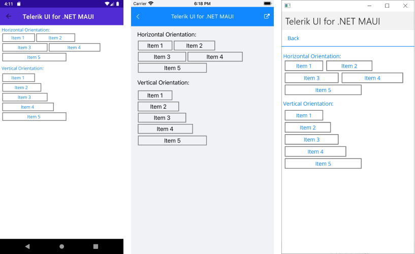
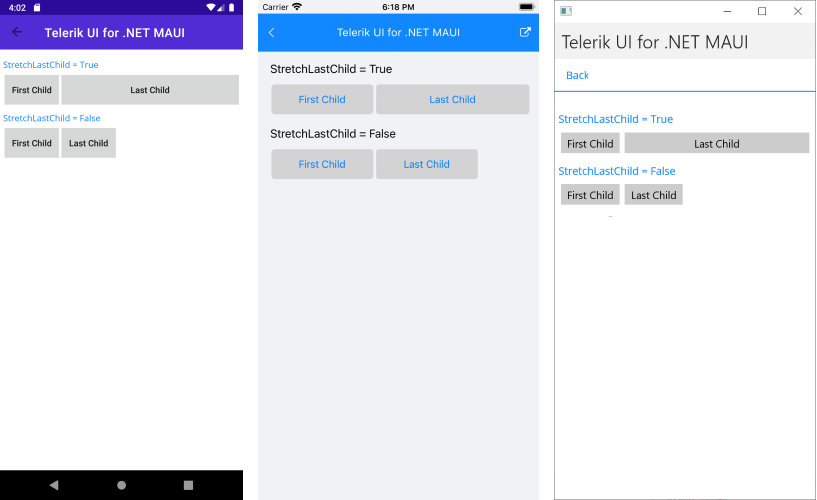

# Wrap functionality

RadWrapLayout is a layout container that lets you position items in rows or columns, based on the `Orientation` property. When the space is filled, the container automatically wraps items onto a new row or column.

## Wrap Orientation

WrapLayout exposes `Orientation` property which specifies whether the child items will be wrapped in rows - Horizontal orientation or in columns - Vertical orientation. By default WrapLayout wraps items horizontally.

Check a quick example below with both "Horizontal" and "Vertical" Orientation:

```XAML
<VerticalStackLayout VerticalOptions="StartAndExpand" Margin="0,0,0,5">
	<Label Text="Horizontal Orientation:"/>
	<telerik:RadWrapLayout Orientation="Horizontal">
		<telerik:RadBorder BorderColor="Gray" BorderThickness="2" Margin="2" WidthRequest="100">
			<Label Text="Item 1" HorizontalOptions="Center" Margin="2"/>
		</telerik:RadBorder>
		<telerik:RadBorder BorderColor="Gray" BorderThickness="2" Margin="2" WidthRequest="120">
			<Label Text="Item 2" HorizontalOptions="Center" Margin="2"/>
		</telerik:RadBorder>
		<telerik:RadBorder BorderColor="Gray" BorderThickness="2" Margin="2" WidthRequest="140">
			<Label Text="Item 3" HorizontalOptions="Center" Margin="2"/>
		</telerik:RadBorder>
		<telerik:RadBorder BorderColor="Gray" BorderThickness="2" Margin="2" WidthRequest="160">
			<Label Text="Item 4" HorizontalOptions="Center" Margin="2"/>
		</telerik:RadBorder>
		<telerik:RadBorder BorderColor="Gray" BorderThickness="2" Margin="2" WidthRequest="200">
			<Label Text="Item 5" HorizontalOptions="Center" Margin="2"/>
		</telerik:RadBorder>
	</telerik:RadWrapLayout>

	<Label Text="Vertical Orientation:" Margin="0,10,0,5"/>
	<telerik:RadWrapLayout Orientation="Vertical">
		<telerik:RadBorder BorderColor="Gray" BorderThickness="2" Margin="2" WidthRequest="100">
			<Label Text="Item 1" HorizontalOptions="Center" Margin="2"/>
		</telerik:RadBorder>
		<telerik:RadBorder BorderColor="Gray" BorderThickness="2" Margin="2" WidthRequest="120">
			<Label Text="Item 2" HorizontalOptions="Center" Margin="2"/>
		</telerik:RadBorder>
		<telerik:RadBorder BorderColor="Gray" BorderThickness="2" Margin="2" WidthRequest="140">
			<Label Text="Item 3" HorizontalOptions="Center" Margin="2"/>
		</telerik:RadBorder>
		<telerik:RadBorder BorderColor="Gray" BorderThickness="2" Margin="2" WidthRequest="160">
			<Label Text="Item 4" HorizontalOptions="Center" Margin="2"/>
		</telerik:RadBorder>
		<telerik:RadBorder BorderColor="Gray" BorderThickness="2" Margin="2" WidthRequest="200">
			<Label Text="Item 5" HorizontalOptions="Center" Margin="2"/>
		</telerik:RadBorder>
	</telerik:RadWrapLayout>
</VerticalStackLayout>
```

where *telerik* is defined like this:

```XAML
xmlns:telerik="clr-namespace:Telerik.Maui.Controls;assembly=Telerik.Maui.Controls"
```

Check the result on different platforms below:



## Item Size

WrapLayout exposes `ItemWidth` and `ItemHeight` properties which define the layout area for each child element. By default the available size for the items is not restricted.

Here is a quick sample of RadWrapLayout with specified item size:

```XAML
<telerik:RadWrapLayout x:Name="wrapLayout" ItemHeight="50" ItemWidth="150" Margin="0,20,0,0">
	<telerikInput:RadButton BorderThickness="1" Text="Item 1" Margin="2"/>
	<telerikInput:RadButton BorderThickness="1" Text="Item 2" Margin="2"/>
	<telerikInput:RadButton BorderThickness="1" Text="Item 3" Margin="2"/>
</telerik:RadWrapLayout>
```

And the result is:


## Configure last child element position

RadWrapLayout exposes `StretchLastChild` property which gives you the option to control the position and layout of the last child item from the layout items collection. If set to *True* the last element will stretch along the remaining space from the last row or column depending on the layout orientation.

Check the example below how `StretchLastChild` would work when set to both values:

<snippet id='wraplayout-position-lastelement'/>
```XAML
<StackLayout Orientation="Vertical" VerticalOptions="Start">
	<Label Text="StretchLastChild = True" Margin="0,0,0,5"/>
	<telerik:RadWrapLayout StretchLastChild="True">
		<telerikInput:RadButton BorderThickness="1" Text="First Child" Margin="2"/>
		<telerikInput:RadButton BorderThickness="1" Text="Last Child" Margin="2"/>
	</telerik:RadWrapLayout>

	<Label Text="StretchLastChild = False" Margin="0,10,0,5"/>
	<telerik:RadWrapLayout StretchLastChild="False">
		<telerikInput:RadButton BorderThickness="1" Text="First Child" Margin="2"/>
		<telerikInput:RadButton BorderThickness="1" Text="Last Child" Margin="2"/>
	</telerik:RadWrapLayout>
</StackLayout>
```

And here is how it looks:



## See Also

- [Getting Started]()
