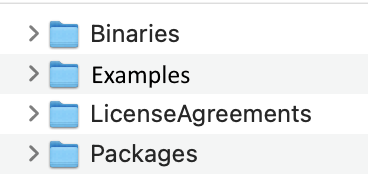

# Getting Started

This guide provides the information you need to start using the Telerik UI for .NET MAUI suite&mdash;it includes instructions about the available download and installation approaches as well as the required handlers and renderers you have to register.

## Set Up Your .NET MAUI Application

1. Before you start with the installation of Telerik UI for .NET MAUI, make sure you have a running .NET MAUI application. For more information on the required steps and system requirements, refer to the [Microsoft .NET MAUI official documentation](https://docs.microsoft.com/en-us/dotnet/maui/get-started/installation).

>important For .NET MAUI Apps you must have **Visual Studio 2022 Preview - 17.1 Preview 1**

## Download Telerik UI for .NET MAUI

Telerik UI for .NET MAUI provides the following approaches to download the library:

* [Using the Telerik UI for .NET MAUI product page](#from-the-product-page)
* [Downloading with your Telerik account](#with-your-telerik-account)

### Using the Product Page

To download Telerik UI for .NET MAUI from its product page:

1. Log into your [Telerik Account](https://www.telerik.com/account/).

1. Go to the [Telerik UI for .NET MAUI product page](https://www.telerik.com/maui-ui).

1. Click the **Download Telerik UI for .NET MAUI** button.

  

1. As a result, the download starts automatically.

  

### Using Your Telerik Account

To download Telerik UI for .NET MAUI from your Telerik account:

1. Log into your [Telerik Account](https://www.telerik.com/account/).

1. Click the __Downloads__ tab.

  

1. Search for MAUI and select the __Telerik UI for .NET MAUI__ product title.

  

1. On the next page, download the `.msi` and `.pkg` automatic installation files, and the Telerik .NET MAUI NuGet Package.

  

## Install Telerik UI for .NET MAUI

Telerik UI for .NET MAUI provides the following installation options:

* [Installing on Windows](#installation-for-windows)
* [Installing on MacOS](#installation-for-macos)
* [Installing with NuGet (for Windows and MacOS)]()

### Installation for Windows

To install Telerik UI for .NET MAUI on Windows:

1. Run the `Telerik_UI_for_Maui_[version]_Preview.msi` file and follow the instructions. The file automatically installs Telerik UI for .NET MAUI on your PC.

    On a 32-bit machine, the wizard will suggest to install the UI for .NET MAUI controls in `C:\Program Files\Progress\`. On a 64-bit machine, the wizard will suggest to install the UI for .NET MAUI controls in `C:\Program Files (x86)\Progress\`.

1. The installation folder provides the following subdirectories:

    * **Binaries**&mdash;Contains the needed assemblies for Android, iOS, MacCatalyst, and WinUI.
    * **Examples**&mdash;Contains the SDK application with the Telerik UI for .NET MAUI controls.
    * **LicenseAgreements**&mdash;Provides the product End-User License Agreement (EULA).
    * **Packages**&mdash;Contains the `Telerik_UI_for_Maui_[version]_Preview.nupkg` file.

    

### Installation for macOS

To install Telerik UI for .NET MAUI on MacOS:

1. Run the `Telerik_UI_for_Maui_[version]_Preview.pkg` file, which automatically installs Telerik UI for .NET MAUI on your Mac.

1. The installation folder provides the following subdirectories:

    * **Binaries**&mdash;Contains the needed dlls for Android, iOS, and MacCatalyst.
    * **Examples**&mdash;Contains the SDK application with the Telerik UI for .NET MAUI controls.
    * **LicenseAgreements**&mdash;Provides the product End-User Licensce Agreement (EULA).
    * **Packages**&mdash;Contains the `Telerik_UI_for_Maui_[version]_Preview.nupkg` file.

    

## Register Required Handlers and Renderers

To visualize the Telerik UI for .NET MAUI controls, you have to register the required renderers by calling the `Telerik.Maui.Controls.Compatibility.UseTelerik` extension method inside the `Configure` method of the `Startup.cs` file of your project.

1. Add the needed `using` settings inside the `Startup.cs` file.

 ```C#
using Telerik.Maui.Controls.Compatibility;
 ```

1. Call the `UseTelerik()` method inside the `Startup.cs` file.

 ```C#

public class Startup : IStartup
{
    public void Configure(IAppHostBuilder appBuilder)
    {
        appBuilder
            .UseFormsCompatibility()
            .ConfigureFonts(fonts => {
                fonts.AddFont("ionicons.ttf", "IonIcons");
            })
            .UseTelerik()
            .UseMauiApp<App>();            
    }
}
 ```

## See Also

* [Installing Telerik UI for .NET MAUI with the Telerik NuGet Server]()
* [Getting Started with Telerik UI for .NET MAUI Demo Application]()
* [Getting Started with Telerik UI for .NET MAUI Barcode]()
