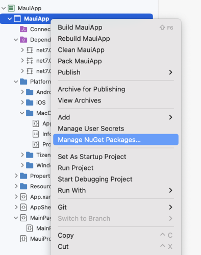

# First Steps by Installing with the NuGet Package on macOS

NuGet is a popular .NET package manager. Progress maintains the Telerik NuGet Feed for registered users and you can include the Telerik UI for .NET MAUI suite in your project as well as update to the latest available version from there.

While installing Telerik UI for .NET MAUI with NuGet works both for Windows and MacOS machines, this tutorial describes how to get up and running with the library by downloading and installing the controls on macOS. Here is the step by step guide you have to follow:

>important The `Telerik.UI.for.Maui` NuGet works with .NET 7.0, .NET 8.0 and .NET 9 at least Preview 6 projects and automatically restores the required packages depending on the .NET version you are using in your project.

## Step 1: Set Up Your .NET MAUI Project

Before you start with the installation of Telerik UI for .NET MAUI, make sure you have a running .NET MAUI application. For more information on the required steps and system requirements, refer to the [Microsoft .NET MAUI official documentation](https://docs.microsoft.com/en-us/dotnet/maui/get-started/installation).

## Step 2: Download Telerik UI for .NET MAUI NuGet Package

Telerik UI for .NET MAUI enables you to download the suite either from the Telerik UI for .NET MAUI product page or through your Telerik account. For the purposes of this tutorial, let's download the batch from your Telerik account:

1. Log into your [Telerik Account](https://www.telerik.com/account/).

1. Click the __Downloads__ tab.

  

1. Search for MAUI and select the __Telerik UI for .NET MAUI__ product title.

  

1. On the next page, download the `.nupkg` or `.zip` files. The `.zip` file contains the Telerik .NET MAUI NuGet Package.

  

## Step 3: Add the Telerik NuGet Package Source to Visual Studio for Mac

Now, let's add the Telerik UI for .NET MAUI package through the Telerik NuGet feed. To use the available packages, you need to have an active Telerik account and to authenticate.

1. Click on the solution folder in Visual Studio for Mac to display the context menu and choose **Manage NuGet Packages**.

  

1. Choose the **Configure Source** option from the drop-down in the lower left corner.

  

1. On the next dialog you can see all the available sources. Choose **Add** to add the new server.

  

1. In the **Location** field, add the Telerik server URL: `https://nuget.telerik.com/v3/index.json`. If you use a locally available NuGet package downloaded from [your account](https://www.telerik.com/account/), add the path to the local package instead of the URL. Finally, click **Add Source**.

  

> The obsolete NuGet v2 server at `https://nuget.telerik.com/nuget` will be sunset in November 2024. To avoid any interruptions in your development process, change the NuGet server URL to `https://nuget.telerik.com/v3/index.json`.

The Telerik server is now ready to use. You can go to your solution and open the **Solution Package Manager**.

## Step 4: Install the Telerik .NET MAUI NuGet Package

Now, you need to add the Telerik package to the .NET MAUI solution project that you created:

1. Select the Telerik NuGet server as a package source and enter your credentials when prompted.
1. Search for the `Telerik.UI.for.Maui` package and select it.
1. Choose the projects which require the package.
1. Select the desired version and click **Add Package**.


## Step 5: Register the Required Handlers

To visualize the [.NET MAUI](https://www.telerik.com/maui-ui) controls, you have to register the required handlers by calling the `Telerik.Maui.Controls.Compatibility.UseTelerik` extension method inside the `Configure` method of the `MauiProgram.cs` file of your project.

1. Add the needed `using` settings inside the `MauiProgram.cs` file.

 ```C#
using Telerik.Maui.Controls.Compatibility;
 ```

1. Call the `UseTelerik()` method inside the `MauiProgram.cs` file.

 ```C#
public static class MauiProgram
{
	public static MauiApp CreateMauiApp()
	{
		var builder = MauiApp.CreateBuilder();
		builder
			.UseTelerik()
			.UseMauiApp<App>()
			.ConfigureFonts(fonts =>
			{
				fonts.AddFont("OpenSans-Regular.ttf", "OpenSansRegular");
			});

		return builder.Build();
	}
}
 ```

## Next Steps

* [Available Product Files and Assemblies]()
* [Restoring NuGet Packages in Your CI Workflow]()
* [Telerik UI for .NET MAUI Installation Approaches]()

## Troubleshooting

This section lists some of the common problems that are observed during NuGet installation.

### Networking Problems

Another common problem is that your machine (PC or DevOps agent) is behind a proxy. To check if you're experiencing a networking issue, open the following URL in your web browser:

https://nuget.telerik.com/nuget/Search()?$filter=IsAbsoluteLatestVersion&searchTerm=%Maui%27&includePrerelease=true&$skip=0&$top=100&semVerLevel=2.0.0. 

After you enter your telerik.com `username` and `password`, you should see an XML search result containing a list of all the `Telerik.UI.for.Maui` packages available with your license.

### Unable to Load the Service Index for Source

The following error may occur if the nuget.telerik.com server is down.

`Unable to load the service index for source https://nuget.telerik.com/v3/index.json`

If you hit that error, make sure that the Telerik NuGet Feed is live at https://status.telerik.com/.

## See Also

* [System Requirements for macOS]()
* [Telerik Toolbox for .NET MAUI on macOS]()
* [Telerik Project Template for VS on macOS]()
* [Telerik UI for .NET MAUI Product Page](https://www.telerik.com/maui-ui)
