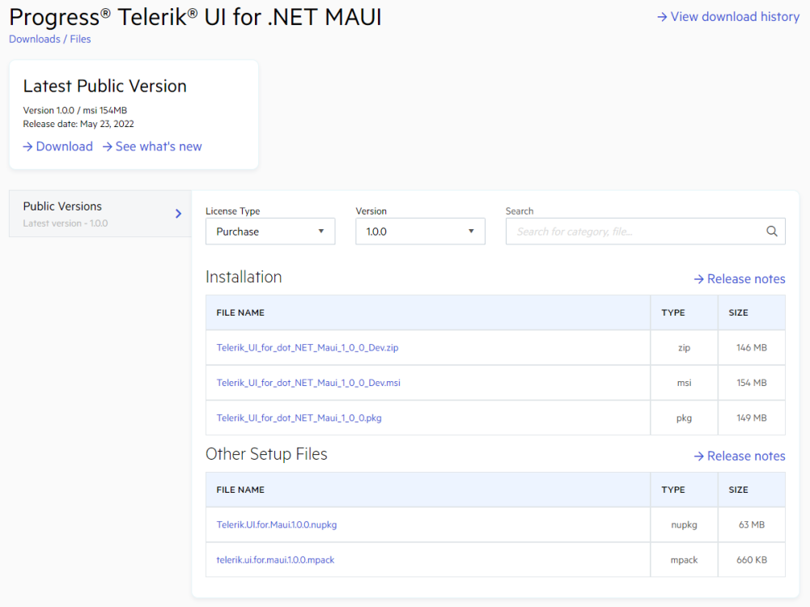
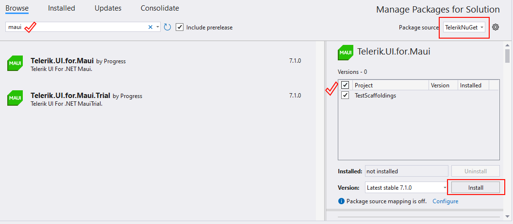

# First Steps by Installing with the NuGet Package on Windows

NuGet is a popular .NET package manager. Progress maintains the Telerik NuGet Feed for registered users and you can include the Telerik UI for .NET MAUI suite in your project as well as update to the latest available version from there.

While installing Telerik UI for .NET MAUI with NuGet works both for Windows and MacOS machines, this tutorial describes how to get up and running with the library by downloading and installing the controls on Windows. Here is the step by step guide you have to follow:

The following video demonstrates how to register the feed on your system and add the product package you need by using Visual Studio for Windows.  

<iframe width="560" height="315" src="https://www.youtube.com/embed/c3m_BLMXNDk" frameborder="0" allow="accelerometer; autoplay; encrypted-media; gyroscope; picture-in-picture" allowfullscreen></iframe>

>important The `Telerik.UI.for.Maui` NuGet works with .NET 6.0 and .NET 7.0 projects and automatically restores the required packages depending on the .NET version you are using in your project.

## Step 1: Set Up Your .NET MAUI Project

Before you start with the installation of Telerik UI for .NET MAUI, make sure you have a running .NET MAUI application. For more information on the required steps and system requirements, refer to the [Microsoft .NET MAUI official documentation](https://docs.microsoft.com/en-us/dotnet/maui/get-started/installation).

## Step 2: Download Telerik UI for .NET MAUI

Telerik UI for .NET MAUI enables you to download the suite either from the Telerik UI for .NET MAUI product page or through your Telerik account. For the purposes of this tutorial, let's download the batch from your Telerik account:

1. Log into your [Telerik Account](https://www.telerik.com/account/).

1. Click the __Downloads__ tab.

  

1. Search for MAUI and select the __Telerik UI for .NET MAUI__ product title.

  

1. On the next page, download the `.msi` and `.pkg` automatic installation files, and the Telerik .NET MAUI NuGet Package.

  

## Step 3: Add the Telerik NuGet Package Source to Visual Studio

Now, let's add the Telerik UI for .NET MAUI package through the Telerik NuGet feed. To use the available packages, you need to have an active Telerik account and to authenticate.

1. In Visual Studio, select **Tools** > **NuGet Package Manager** > **Package Manager Settings**.

  

1. Select **Package Sources**.

  

1. In the **Source** field, add the Telerik server by filling in its [`https://nuget.telerik.com/v3/index.json`](https://nuget.telerik.com/v3/index.json) URL. Click **Update**.

  Note that the [`https://nuget.telerik.com/v3/index.json`](https://nuget.telerik.com/v3/index.json) server will be deprecated and you are recommended to switch to the v3 API, which is faster, more lightweight, and also reduces the number of requests from NuGet clients.

  

The Telerik server is now ready to use. You can go to your solution and open the **Solution Package Manager**.

## Step 4: Install the Telerik .NET MAUI NuGet Package

Now, you need to add the Telerik package to the .NET MAUI solution project that you created:

1. Select the Telerik NuGet server as a package source and enter your credentials when prompted.
1. Search for the `Telerik.UI.for.Maui` package and select it.
1. Choose the projects which require the package.
1. Select the desired version and click **Install**.

## Next Steps

* [Available Product Files and Assemblies]()
* [Restoring NuGet Packages in Your CI Workflow]()
* [Telerik UI for .NET MAUI Installation Approaches]()

## Troubleshooting

This section lists some of the common problems that are observed during NuGet installation.

### '401 Logon failed' error

If you're receiving this error when connecting to Telerik Nuget Server, you could try to update your NuGet credentials through the Windows Credential Manager. Please follow the steps below:

1. Close all open Visual Studio instances (this is so that all NuGet package manager tasks are stopped).
2. Open the "Credential Manager" app on your PC.
3. Scroll through all the entries until you find any that are for nuget.telerik.com.
4. Once you find that entry, expand it and select "edit".
5. Make sure the username and password are the same ones you use for your Telerik account and clisk
    1. Use the email address in the place of username
    2. Make sure any special characters are escaped (see *Handling Special Characters in Password* below)
    3. Click "Save" 
6. Make sure the URL does not have a trailing slash. It must be only be `https://nuget.telerik.com/nuget`
7. Reopen Visual Studio and access the Telerik NuGet server. 

### Handling Special Characters in Password

If your password contains a special character, those characters need to be escaped or it may fail authentication resulting in *Error 401 login failure* from the NuGet server. A common character that needs to be escaped is the ampersand `&`, but it can be as unique as the section character `§`. There are two ways to handle this.

1. Change the password so that it only includes characters that do not need to be escaped
2. HTML encode the password so the special characters are escaped (e.g. `my§uper&P@§§word` becomes `my&sect;uper&amp;P@&sect;&sect;word`).

We **strongly** discourage entering your password into an online encoder utility, use Powershell instead. Here's one example:

	Add-Type -AssemblyName System.Web
	[System.Web.HttpUtility]::HtmlEncode('my§uper&P@§§word')

Result:

### Networking Problems

Another common problem is that your machine (PC or DevOps agent) is behind a proxy. To check if you're experiencing a networking issue, open the following URL in your web browser:

https://nuget.telerik.com/nuget/Search()?$filter=IsAbsoluteLatestVersion&searchTerm=%27Maui%27&includePrerelease=true&$skip=0&$top=100&semVerLevel=2.0.0. 

After you enter your telerik.com `username` and `password`, you should see an XML search result containing a list of all the `Telerik.UI.for.Maui` packages available with your license.

### Unable to Load the Service Index for Source

The following error may occur if the nuget.telerik.com server is down.

`Unable to load the service index for source https://nuget.telerik.com/v3/index.json`

If you hit that error, make sure that the Telerik NuGet Feed is live at https://status.telerik.com/.

## See Also

* [System Requirements for Windows]()
* [Telerik Toolbox for .NET MAUI on Windows]()
* [Telerik Extensions and Project Templates for VS on Windows]()
* [Telerik UI for .NET MAUI Product Page](https://www.telerik.com/maui-ui)
