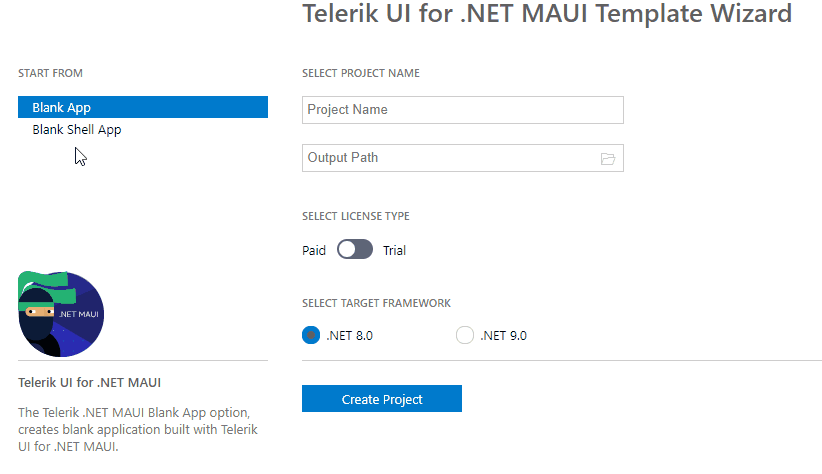

# Create New Projects

This article demonstrates how to use the Telerik Extension for Visual Studio Code to create a new project that is pre-configured for the Progress&reg; Telerik&reg; UI for .NET MAUI components.

## Get the Extension

To use the **Telerik UI for .NET MAUI Template Wizard**, install the Telerik UI for .NET MAUI Visual Studio Code Extension. You can get the extension from:

 - [The Visual Studio Marketplace](https://marketplace.visualstudio.com/items?itemName=TelerikInc.telerik-maui-productivity-tools).

 - The Extensions tab in Visual Studio Code - search for Telerik UI for .NET MAUI Productivity Tools, select the extension, and then click Install.

## Start the Wizard

You can create a Telerik .NET MAUI project by accessing the project template feature from the Visual Studio Code Extensions menu. To open the menu, use:

 - `Ctrl+Shift+P` in Windows/Linux 
 - `Cmd+Shift+P` on Mac. 

Next in the menu, look for and select **Telerik UI for .NET MAUI Template Wizard: Launch** and press Enter. 



## Set up the Telerik NuGet Server

You can use one of the following options to configure the required credentials for your Telerik license (trial or commercial):

### Using the .NET CLI

Run `dotnet nuget add source`.

When you are adding NuGet sources from the .NET CLI, the credentials are stored inside the `Nuget.Config` file. This command creates or updates the `NuGet.Config` file with your Telerik license credentials for you, so you don't have to edit it manually.

See also: [Restoring NuGet Packages in Your CI Workflow]().

### Editing the NuGet.Config File

NuGet package sources and other settings are stored in a `NuGet.Config` file. You can read more about the file structure in the Microsoft article: [NuGet.Config References](https://learn.microsoft.com/en-us/nuget/reference/nuget-config-file). To edit the file and add the Telerik feed, you need to: 

1. Ensure you are editing the correct and desired `.config` file. You can also create a new one with the `dotnet new nugetconfig` command. 
1. Add the Telerik package source to the `.config` file. 

Here is a sample `NuGet.Config` file:

```xml
<?xml version="1.0" encoding="utf-8"?>
<configuration>
    <packageSources>
    <!--To inherit the global NuGet package sources remove the <clear/> line below -->
    <clear />
    <add key="nuget" value="https://api.nuget.org/v3/index.json" />
    <add key="TelerikOnlineFeed" value="https://nuget.telerik.com/v3/index.json" />
    </packageSources>
    <packageSourceCredentials>
    <TelerikOnlineFeed>
        <add key="Username" value="telerik-email or api-key>" />
        <add key="ClearTextPassword" value="PASTE_YOUR_TELERIK_PASSWORD_OR_TELERIK_NUGET_KEY_HERE" />
    </TelerikOnlineFeed>
    </packageSourceCredentials>
</configuration>
```

See also: [How to Generate NuGet Key](#generating-nuget-keys).

> Use plain text credentials, because the .NET Core NuGet tooling does not fully support encrypted credentials. 

**Telerik NuGet Server Version**

> The obsolete NuGet v2 server at `https://nuget.telerik.com/nuget` will be sunset in November 2024. To avoid any interruptions in your development process, change the NuGet server URL to `https://nuget.telerik.com/v3/index.json`.

## Select a Project

The Create New Project wizard provides two options to start you project:

 -  Blank App&mdash;Allows you to create a blank project that is pre-configured for the Progress® Telerik® UI for .NET MAUI components.
 -  Blank Shell App&mdash;Allows you to create a blank shell project that is pre-configured for the Progress® Telerik® UI for .NET MAUI components.

## Configure the Project

The wizard allows you to configure the following options:

  - Project name
  - Location of the created project (Output Path)
  - Your Telerik license (trial or commercial)
  - The .NET version you want to use