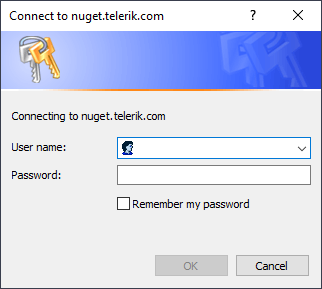

# Visual Studio Extensions

**Visual Studio Extensions** for Telerik UI for .NET MAUI aim to help developers when creating .NET MAUI Application with Telerik .NET MAUI components.

The extensions handle the following major points in the development with Telerik UI for .NET MAUI:

* **Project creation**: Through the [Telerik .NET MAUI App (Preview)](#using-the-telerik-net-maui-app-preview-template) project template you can quickly create an application pre-configured to use Telerik UI for .NET MAUI;

## Prerequisites

Visual Studio installation needs to have the following components included:

* **Mobile Development with .NET** workload with **.NET MAUI (Preview)** component;

* **Text Template Transformation** individual component;

## Using the Telerik .NET MAUI App (Preview) template

The Telerik .NET MAUI App (Preview) project template is installed as part of the [Telerik UI for .NET msi installation].

When you finish with the automatic installation, you're ready to utilize the project template:

1. Open Visual Studio and choose "Create a new project" option;

2. Search for "maui":

	

3. Choose __Telerik .NET MAUI App (Preview)__ project template;

4. "Configure your new project" screen gives you the option to set the project name and location:

	

5. Directly go to "Finish" from th next screen:

	
	
Visual Studio opens the solution directly configured to use our .NET MAUI controls - Telerik.UI.for.Maui nuget package is installed. 

If you do not have the [Telerik Nuget Server]() set up in Visual Studio, a message will pop up, so you can enter your Telerik credentials and the Telerik Nuget Server will be automatically configured as nuget source in Visual Studio:

Here is the result after running the app:

## Troubleshooting

#### Nuget package restore failed

*Reason:*

Telerik Nuget Server has not been properly configured.

*Suggested solution:*

1. Manually add the Telerik Nuget Server as a nuget package source in Visual Studio following the instructions here: [Installing with NuGet](#prerequisites).

2. Go to the solution in Visual Studio and choose "Restore NuGet Packages" from the context menu.

3. Clean and rebuild the solution.

## See Also

- [Telerik Nuget Server]()