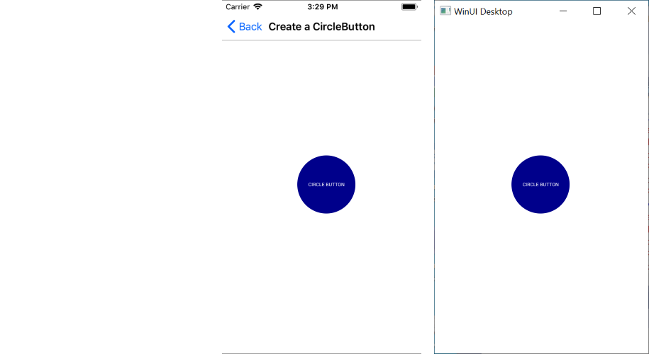

## Environment

<table>
	<tbody>
    <tr>
      <td>Product</td>
      <td>Telerik UI for .NET MAUI Button</td>
    </tr>
  	<tr>
  		<td>Product Version</td>
  		<td>0.2.0</td>
  	</tr>
	</tbody>
</table>

## Description

How can I create a circular Button based on the Button control for my Telerik UI for .NET MAUI project?

## Solution

To create a circular button with the Telerik UI for .NET MAUI Button, adjust its `Width`, `Height`, and `BorderRadius` properties in the following way:

1. Set `Width` as equal to `Height`.
1. Set `BorderRadius` as half of the `Width`/`Height` value.

>important In some cases, you may need to set a `BorderWidth` value in order for the `BorderRadius` to take effect.

The following example demonstrates how to implement the suggested approach. Note that the `CornerRadius` property is not supported on Android. For more information, refer to the article on [implementing the `CornerRadius` support](https://github.com/dotnet/maui/wiki/Status#%EF%B8%8F-button).

1. Define the `RadButton`:

 ```XAML
<telerik:RadButton WidthRequest="120"
					    HeightRequest="120"                                
					    Text="Circle Button"
					    FontSize="Micro"
					    TextColor="White"
					    BackgroundColor="DarkBlue"
					    CornerRadius="60"  />
 ```

1. Add the namespace:

 ```XAML
xmlns:telerik="http://schemas.telerik.com/2022/xaml/maui"
 ```

The following image shows the end result.


