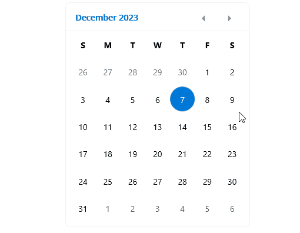

## Environment
<table>
    <tbody>
        <tr>
            <td>Product</td>
            <td>Calendar for .NET MAUI</td>
        </tr>
    </tbody>
</table>


## Description

This article shows how to select a week in the Calendar for .NET MAUI when tapping or clicking on a date from this week. In the end, you will receive the following result:



## Solution

To achieve the desired result, define a Calendar, and then handle the `SelectionChanged` event:

**1.** Define the Calendar in XAML:

```XAML
<Grid>
    <telerik:RadCalendar x:Name="calendar"
                            HorizontalOptions="Center" 
                            VerticalOptions="Center"
                            SelectionMode="Range"
                            SelectionChanged="OnCalendarSelectionChanged" />
</Grid>
```

**2.** Handle the `SelectionChanged` event to get the first day of the week, and then select the range for the whole week.

```C#
public partial class MainPage : ContentPage
{
    private bool isInternalSelection = false;

    public MainPage()
    {
        InitializeComponent();
    }

    private void OnCalendarSelectionChanged(object sender, Telerik.Maui.Controls.Calendar.CalendarSelectionChangedEventArgs e)
    {
        if (this.isInternalSelection)
        {
            return;
        }

        var selectedDate = e.AddedDates.First();
        var culture = this.calendar.Culture ?? CultureInfo.CurrentCulture;
        var firstDayOfWeek = this.calendar.FirstDayOfWeek ?? culture.DateTimeFormat.FirstDayOfWeek;

        var rangeStart = this.GetFirstDayOfWeek(selectedDate, firstDayOfWeek);
        var rangeEnd = rangeStart.AddDays(6);

        var selectedDates = (CalendarSelectionCollection)this.calendar.SelectedDates;

        this.isInternalSelection = true;
        selectedDates.AddRange(rangeStart, rangeEnd);
        this.isInternalSelection = false;
    }

    private DateTime GetFirstDayOfWeek(DateTime dateTime, DayOfWeek weekStart)
    {
        var selectedDay = (int)dateTime.DayOfWeek;
        if (selectedDay < (int)weekStart)
        {
            selectedDay += 7;
        }

        int daysToSubtract = selectedDay - (int)weekStart;
        DateTime result = dateTime.AddDays(-daysToSubtract);
        return result;
    }
}
```