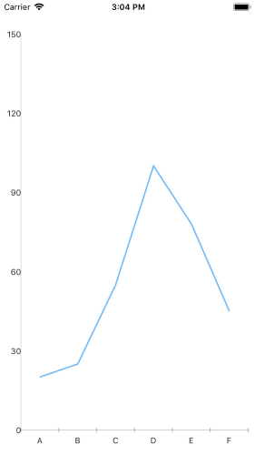

## Environment
<table>
    <tbody>
        <tr>
            <td>Product Version</td>
            <td>6.5.0</td>
        </tr>
        <tr>
            <td>Product</td>
            <td>Chart for .NET MAUI</td>
        </tr>
    </tbody>
</table>


## Description

The differences between the vertical axis labels position is because the native Android and iOS charts are two different controls and do not have 100 % appearance-matching across all the platforms. In order to make any further customization on the RadChart control, the native chart should be used. This article will show you how to position the VericalAxes Labels on iOS on the left to make it look as on Android.



## Solution

**1.** Define the needed business objects:

```C#
public class CategoricalData
{
    public object Category { get; set; }

    public double Value { get; set; }
}
```

**2.** Create a sample ViewModel:

```C#
public class CategoricalDataViewModel
{
    public ObservableCollection<CategoricalData> Data { get; set; }

    public CategoricalDataViewModel()
    {
        this.Data = GetCategoricalData();
    }

    private static ObservableCollection<CategoricalData> GetCategoricalData()
    {
        var data = new ObservableCollection<CategoricalData>
        {
            new CategoricalData { Category = "A", Value = 101 },
            new CategoricalData { Category = "B", Value = 45 },
            new CategoricalData { Category = "C", Value = 77 },
            new CategoricalData { Category = "D", Value = 15 },
            new CategoricalData { Category = "E", Value = 56 },
        };
        return data;
    }
}
```

**3.** Define the Chart control in XAML:

```XAML
<telerik:RadCartesianChart x:Name="chart">
    <telerik:RadCartesianChart.BindingContext>
        <local:CategoricalDataViewModel />
    </telerik:RadCartesianChart.BindingContext>
    <telerik:RadCartesianChart.HorizontalAxis>
        <telerik:CategoricalAxis LabelFitMode="MultiLine"
                                 PlotMode="OnTicks" />
    </telerik:RadCartesianChart.HorizontalAxis>
    <telerik:RadCartesianChart.VerticalAxis>
        <telerik:NumericalAxis />
    </telerik:RadCartesianChart.VerticalAxis>
    <telerik:RadCartesianChart.Series>
        <telerik:LineSeries ValueBinding="Value"
                            CategoryBinding="Category"
                            ItemsSource="{Binding Data}" />
    </telerik:RadCartesianChart.Series>
</telerik:RadCartesianChart>
```

**4.** Access the native Chart by subscribing to the `HandlerChanged`event:

```C#
public partial class MainPage : ContentPage
{
    public MainPage()
    {
        InitializeComponent();
        this.BindingContext = new SeriesCategoricalViewModel();

        this.chart.HandlerChanged += this.Chart_HandlerChanged;
    }

    private void Chart_HandlerChanged(object sender, EventArgs e)
    {
        this.UpdateChart();
    }

    private void UpdateChart()
    {
        var platformView = this.chart.Handler.PlatformView;
#if IOS || MACCATALYST
        var platformChart = (Telerik.Maui.Controls.Compatibility.ChartRenderer.iOS.TKExtendedChart)platformView;
        platformChart.YAxis.Style.LineHidden = false;
        platformChart.YAxis.Style.LabelStyle.TextAlignment = TelerikUI.TKChartAxisLabelAlignment.Left;
        platformChart.YAxis.Style.LabelStyle.FirstLabelTextAlignment = TelerikUI.TKChartAxisLabelAlignment.Left;

#endif
    }
}
```
