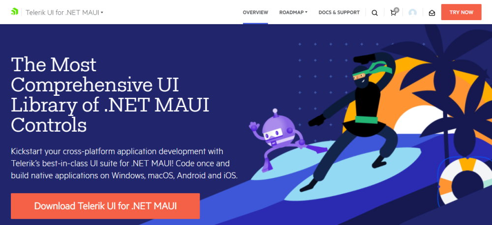
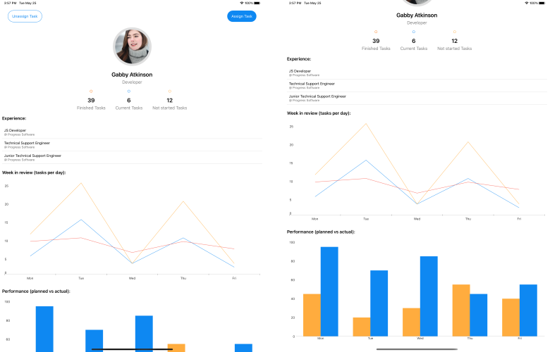

#  Telerik UI for MAUI Demo Application

## Where is the DemoApp location:

**1. Log into your [Telerik account](https://www.telerik.com/account/).**

**2. Go to [Telerik UI for MAUI product page](https://www.telerik.com/maui-ui)**

**3. Click Download Telerik UI for MAUI button:**

**4. The download starts automatically**

**Installation for Windows**

* Telerik_UI_for_Maui_[version]_Preview.msi - runnable msi file used for automatic installation (for use on PC). Run the MSI file and follow the instructions. On a 32bit machine the wizard will install the UI for MAUI component in the following folder unless you specify otherwise: C:\Program Files\Progress\ or C:\Program Files (x86)\Progress\ for a 64bit machine.

The DemoApp folder is inside the installation folder. The Installation folder has the following subdirectories:

* Binaries - Contains the needed dlls for Android, iOS and WinUI
* **DemoApp** - Demo App with Telerik UI for .NET MAUI controls
* LicenseAgreements - provides the product EULA.
* Packages - Telerik_UI_for_Maui_[version]_Preview.nupkg file

**Installation for macOS**

* Telerik_UI_for_Maui_[version]_Preview.pkg - runnable pkg file used for automatic installation (for use on Mac).

The DemoApp folder is inside the installation folder. The installation folder has the following subdirectories:

* Binaries - Contains the needed dlls for Android, iOS and WinUI
* **DemoApp** - Demo App with Telerik UI for .NET MAUI controls
* LicenseAgreements - provides the product EULA.
* Packages - Telerik_UI_for_Maui_[version]_Preview.nupkg file

## Run Demo App using Visual Studio Code for Windows

* Open the HelloMaui folder in Visual Studio Code

* Wait the project to restore

* Install for example additional extention like Comet for .NET Mobile which allows you to build and launch the app on emulator, etc.

* Select Project's Target Framework

* Select the emulator/device you want to run the app

## Run on WinUI

* Open the DemoAppWinUI3.sln file in **Visual Studio 2022 Preview**

>important If you want to build and run the app on WinUI you must install the [Single-Project MSIX Packaging Tool for VS 2022 Preview](https://marketplace.visualstudio.com/items?itemName=ProjectReunion.MicrosoftSingleProjectMSIXPackagingToolsDev17)

* Run the Demo app on WinUI

### Demo App on Android

### Demo App on iPad

### Demo App on WinUI

## See Also

* [Border]()
* [Button]()
* [Chart]()
* [ItemsControl]()
