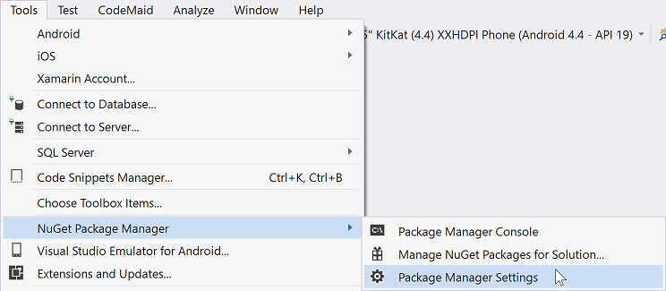

# Telerik NuGet Server

The following steps demonstrate how you can take advantage of **Telerik NuGet server** in order to include Telerik UI for .NET MAUI suite in your solution and/or update to the latest available version.

>important The credentials needed to access Telerik Nuget server are the same you use to log into your [Telerik Account](https://www.telerik.com/account).

## Visual Studio for Windows

<iframe width="560" height="315" src="https://www.youtube.com/embed/c3m_BLMXNDk" frameborder="0" allow="accelerometer; autoplay; encrypted-media; gyroscope; picture-in-picture" allowfullscreen></iframe>

The first step is to add the Telerik server to the NuGet package sources. This can be done in the Package Manager Settings from the Tools menu.

In the the Package Sources section you can add new sources.

In the Source field you should fill in the address of the Telerik server (URL: **https://nuget.telerik.com/v3/index.json**) and click the Update button.

> The old [https://nuget.telerik.com/nuget](https://nuget.telerik.com/nuget) server will be deprecated and we encourage our clients to switch to the v3 API. The new v3 API is faster, lighter, and reduces the number of requests from NuGet clients.

The Telerik server is now ready to use. You can go to your solution and open the solution package manager.

### Add Telerik UI for .NET MAUI pack in Visual Studio for Windows

Find the **Telerik.UI.for.Maui** package and install it to your projects following these steps:

1. Select the Telerik server as a package source and enter your credentials when prompted.
1. Search for the Telerik.UI.for.Maui package.
1. Select the package when found.
1. Select which projects will have the package installed.
1. Choose the version and click Install.

## See Also

- [Demo App]()
