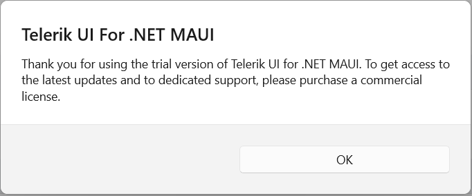

# How to Upgrade Telerik UI for .NET MAUI

This article explains how to upgrade to a new version of Telerik UI for .NET MAUI.

To upgrade the Telerik components, you need to update their NuGet package reference.

The **latest** available version of UI for .NET MAUI is **7.0.0**.

>tip Before starting an upgrade of your project, you may find it useful to review the following information:
> - <a href="https://www.telerik.com/support/whats-new/maui-ui/release-history" target="_blank">UI for .NET MAUI Release History</a>&mdash;reviewing the release notes for all releases you go through will let you see what has changed, what fixes, features and components have been implemented.
> - Whether you are affected by a breaking change. The [List of Telerik UI for .NET MAUI Versions with Breaking Changes]() article shows which releases of our component suite have breaking changes. Review the information for the releases you go through so you can evaluate whether you will be affected by anything.

In this article:

* [Upgrade Using the Telerik NuGet Server](#upgrade-using-the-telerik-nuget-server)
* [Upgrade Manually Added Assemblies](#upgrade-manually-added-assemblies)
* [Upgrade from Trial to Commercial](#upgrade-from-trial-to-commercial)
* [Troubleshooting](#troubleshooting)

## Upgrade Using the Telerik NuGet Server

To upgrade the Telerik UI for .NET MAUI components used in your project, perform the following steps:

1. Make sure that you have a NuGet feed source with the version you want to upgrade to. This is usually the Telerik NuGet Feed&mdash;on [Windows]() or [MacOS](), but you can also use a local feed from our [MSI installer]() or [PKG installer]() or [ZIP archive]().

1. Update the version of the `Telerik.UI.for.Maui` package your project references. If you are using a trial version, the package name is `Telerik.UI.for.Maui.Trial`.

## Upgrade Manually Added Assemblies

To upgrade your components to a newer version of the suite, you need to perform the instructions described in the [Manually Using Assembly References](#manually-using-assembly-references) article.

> If you have installed the trial version of Telerik UI for .NET MAUI and want to install the developer version, you have to remove the trial version first.

## Upgrade from Trial to Commercial

If you have purchased a license and you need to migrate from the trial package to the licensed version, perform the following steps:

1. Make sure that you have a NuGet feed source with the version you want to upgrade to. This is usually the Telerik NuGet Feed&mdash;on [Windows]() or [MacOS](), but you can also use a local feed from our [MSI installer]() or [PKG installer]() or [ZIP archive]().

1. Replace the reference to the `Telerik.UI.for.Maui.Trial` package in your project with a reference to the `Telerik.UI.for.Maui` package.

    * If you are referencing other Telerik trial packages that you now have a license for, remove the `.Trial` from their names.

1. Clean the solution.

1. Delete the `bin` and `obj` folders where packages and assemblies may be cached.

1. Re-build your project.

1. Run the application.

## Troubleshooting

### I Still See the Trial Message

While using a trial license, a trial message is rendered over the components and you will see an alter with the following message:

If you have a commercial license, but you still see the trial message, try the following process:

1. Ensure that the licensed package is referenced in the project (`Telerik.UI.for.Maui` instead of `Telerik.UI.for.Maui.Trial`).

1. Uninstall any Trial installations from the machine.

1. If you have created local NuGet feeds, ensure they do not contain Trial versions of our packages.

1. <a href="https://docs.microsoft.com/en-us/nuget/consume-packages/managing-the-global-packages-and-cache-folders#clearing-local-folders" target="_blank">Clean the NuGet packages</a> on the machine.
1. Clean the projects.

1. Delete the `bin` and `obj` folders where packages and assemblies may be cached.

1. Re-build your project.